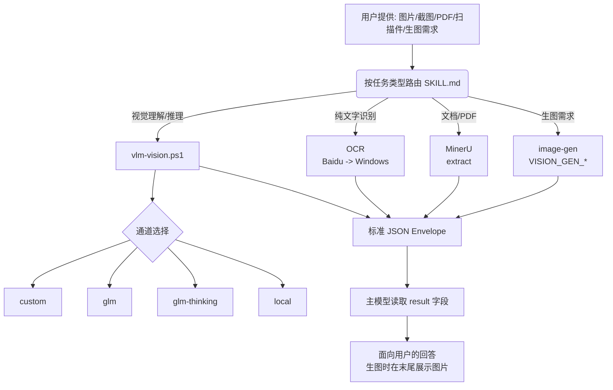

# DS 视觉桥 Plus (ds-vision-skill-plus)

> **DS 视觉桥 Plus** —— 或是目前解决 DeepSeek 视觉问题的最佳方案？
>
> 这是一个给纯文本推理模型（DeepSeek 等）加"眼睛"的多通道视觉增强 Skill。它不替代主模型，而是负责**视觉任务识别、工具选择、结果整理**：
> - **视觉增强**：把图片、截图、PDF、扫描件利用第三方多模态模型转成文本/标准化 JSON 后，交给 DeepSeek 推理。
> - **生图转发**：支持生图转发，把生图需求交给用户配置的第三方模型，生成结果以图片形式展示给用户。
>
> *(ps：本项目由 [Sorwcyra/ds-vision-skill: ds-vision-skill：专注于视觉技能的开源项目，提供高效、可复用的计算机视觉能力，助力AI应用快速落地。](https://github.com/Sorwcyra/ds-vision-skill) 演进而来)*

---

##  作者寄语

最近 `deepseek-v4-flash-0731` 的发布开启了新一轮缩圈，可多模态问题仍旧是 DeepSeek 的最大缺点（都这价格了要什么自行车）。在开发过程中，Agent 可能会因为没有视觉功能而在用户对需求理解上产生较大误解，这使得视觉功能成为了一个**可以不用，但不能没有**的模块。

此 Skill 是基于 Chenyang Wang 大佬的 ds-vision-skill的 思路进行的改良版本，核心提升在于以下两点：
1.  **视觉通道通用化**：从固定 GLM 模型改为 **通用 OpenAI 兼容模型配置**，解决原 Skill 硬编码和无法迭代新模型进行识图能力提升的问题。
2.  **新增生图功能**：实现给纯文本推理模型也能做到像 **多模态模型** 一样在 Agent 工具里进行生图。识图通道和生图通道为独立配置，相互解耦。若没有生图需求，可单独配置识图模型，Skill 会自动判断并正常执行识图功能。

> **Q: 现在 GPT 和 Codex 融为一体，直接 GPT-Plus 就能完成的任务为什么还要安装这个 Skill？**
>
> **A:** 在开发 Skill 过程中我也有思考这个问题。即使站在作者本人层面上来说，也无法否定装了 `deepseek + ds-vision-skill-plus` 能力上还是不如直接 GPT-Plus 强。但开发这个 Skill 的初衷在于为最平民易用的 `deepseek-v4-flash-0731 + reasonix` 拓展能力，达到**极低成本获得较高的 Vibe Coding 体验**。
>
> 并且由于识图/生图模型可自由配置，未来出了更强的识图/生图模型也能继续为 DeepSeek 等一众纯文本推理模型赋能。毕竟并不是所有人都需要每个月花 20 刀来用 GPT-Plus。实际上如果不是进行真正意义上企业级项目开发，依据我本人经验来看 `deepseek-v4-flash-0731` 能力也完全够用了。
>
> 如果你生成了一坨"屎山"代码，不妨试试优化 Prompt，为 Agent 添加 Skill、MCP、Plugin 拓展 Agent 本身的能力呢？最后也希望 DeepSeek 能够越来越好，梁圣恩情还不完啊！！！
>
> —— 2026/8/4 KagaribiDev

---

##  免责声明

1.  **系统兼容性**：`ds-vision-skill-plus` 只在 **Windows 系统**上进行过测试，对于 Mac 用户的适配可能存在问题。
2.  **Agent 兼容性测试**：
    -   测试用 Agent 有 Codex, Zcode, Reasonix。
    -   在测试过程中 Zcode, Reasonix 均能完美调用 Skill 生图和识图功能。
    -   **Codex 特殊情况**：Codex 生图功能正常，但无法在附件里上传图片。预测是 ccswitch 有强制校验功能不允许外接 DS 情况下上传图片。
    -   **解决方案**：直接让 Codex 自己读取图片。
    -   *Prompt 示例*：`解释一下内容 <图片路径> 2026-08-04 132739.png`
3.  **具体测试模型配置参考**：
    -   **识图模型**：
        ```properties
        base_url=https://dashscope.aliyuncs.com/compatible-mode/v1
        model=qwen3.7-plus
        # 自行去(https://platform.qianwenai.com/home)注册,有免费额度
        api_key=sk-xxxxxxx
        ```
    -   **生图模型**：
        ```properties
        base_url=https://api.siliconflow.cn/v1/images/generations
        model=Kwai-Kolors/Kolors
        # 自行去(https://cloud.siliconflow.cn/me/account/ak)注册，有免费额度
        api_key=sk-xxxxxxx
        ```
4.  作者为第一次写实用性开源 Skill，表述可能存在不当，如有疑问可向作者进行反馈，作者很好说话的喵。

---

##  快速开始

### 1. 安装

在 PowerShell 中执行以下命令进行安装：

```powershell
git clone https://github.com/KagaribiDev/ds-vision-skill-plus.git "$env:USERPROFILE\.reasonix\skills\ds-vision-skill-plus"
```

安装后先配置通道（见下），即可直接使用：向 Reasonix/DeepSeek 发一张图片或一个 PDF 问"看看这张图"、"识别图中文字"、"解析这个文档"，或说"帮我画一张图"，即可自动路由。

### 2. 配置云端通道

请先进入你的 Skill 目录：
（ps:api_key会存到你的用户变量里请不用担心密钥泄露的问题）
```powershell
# 此处以 Reasonix 为例，其他 Agent 同理
# 如果是第一次安装skill则skills目录可能不存在，若不存在自己建一个skills即可
cd C:\Users\<用户名>\.reasonix\skills
```

**配置命令速查：**
| 功能 | 命令 | 说明 |
| :--- | :--- | :--- |
| **配置视觉默认通道** | `scripts\setup.ps1 -SetCustom -BaseUrl <url> -Key <key> -Model <model> -Verify` | **必配**才能识图；可配任意 OpenAI 兼容模型 |
| **配置免费降级通道** | `scripts\setup.ps1 -SetKey -Channel glm -Key <key> -Verify` | 建议配置，用于兜底 |
| **配置生图通道** | `scripts\setup.ps1 -SetGen -BaseUrl <url> -Key <key> -Model <model> -Verify` | **必配**才能生图；服务商需支持 `images/generations` |
| **查看状态** | `scripts\setup.ps1 -Status` | 查看当前可用通道配置情况 |

**详细配置示例：**

```powershell
# 1. 查看可用通道（此时应为 missing: xxx_API_KEY）
scripts\setup.ps1 -Status

# 2. 配置视觉默认通道（必配才能识图；也可只配 GLM 走免费兜底）
scripts\setup.ps1 -SetCustom -BaseUrl https://dashscope.aliyuncs.com/compatible-mode/v1 -Key sk-xx -Model qwen3.7-plus -Verify

# 3. 配置生图通道（必配才能生图；服务商需支持 images/generations）
scripts\setup.ps1 -SetGen -BaseUrl https://api.siliconflow.cn/v1/images/generations -Key sk-xx -Model Kwai-Kolors/Kolors -Verify

# 4. 再次查看可用通道（此时若为 configured 则配置成功）
scripts\setup.ps1 -Status
```

### 3. 常用脚本指令

| 功能            | 命令示例                                                                                 |        |       |
| :------------ | :----------------------------------------------------------------------------------- | ------ | ----- |
| **识图**        | `scripts\vlm-vision.ps1 -ImagePath <图片路径> -Prompt "用中文描述这张图片" -Channel custom -Json` |        |       |
| **生图**        | `scripts\image-gen.ps1 -Prompt "一只戴着眼镜的柴犬,卡通风格" -Json`                               |        |       |
| **纯文字提取**     | `scripts\baidu-ocr.ps1 -ImagePath <图片路径> -Json`                                      |        |       |
| **文档/PDF 解析** | `scripts\mineru-extract.ps1 -FilePath <文档路径> -Json`                                  |        |       |
| **移除配置**      | `scripts\setup.ps1 -RemoveKey -Channel <name>`                                         | custom | gen |

### 4. 配置引导

```powershell
scripts\setup.ps1 -Help # 查看注册入口与命令

# 默认视觉通道（可配任意openai兼容模型）
scripts\setup.ps1 -SetCustom -BaseUrl <url> -Key <key> -Model <model> -Verify

# 生图通道（必配才能生图）
scripts\setup.ps1 -SetGen -BaseUrl <url> -Key <key> -Model <model> -Verify

# GLM 免费降级通道
scripts\setup.ps1 -SetKey -Channel glm -Key <key> -Verify

# 百度 OCR 通道
scripts\setup.ps1 -SetKey -Channel baidu-ocr -Key <ak> -Secret <sk> -Verify
```

> **注意**：配置写入用户级环境变量（注册表），立即生效；脚本输出只显示 key 掩码，不打印明文。

---

##  功能特性

-   **通用视觉模型配置**：视觉默认通道为 `custom`，请求路径 / API Key / 模型名统一按 OpenAI 规范配置（`VISION_CUSTOM_BASE_URL` / `VISION_CUSTOM_API_KEY` / `VISION_CUSTOM_MODEL`），想用 Qwen、GLM、GPT-4o 或任何 OpenAI 兼容模型都只需填一次配置，不再有专门的固定模型通道。
-   **生图转发**：Agent 收到生图需求自动调用 `image-gen.ps1`，按 OpenAI 标准 `images/generations` 接口转发到用户配置的生图模型（`VISION_GEN_*`），生成完毕保存到用户 Downloads 目录并在回答末尾展示图片（三级展示策略：URL → 工作区相对路径 → base64）。
-   **免费兜底**：GLM-4V-Flash / GLM-4.1V-Thinking-Flash 保留为降级通道，custom 失败自动切换，不额外花钱。
-   **三层视觉能力**：视觉理解（custom 默认 / GLM 免费降级）、文档解析（MinerU）、OCR（百度 OCR 优先，Windows 本地 OCR 兜底）。
-   **自动路由**：按任务类型（生图 / 图片理解 / 文档解析 / 纯文字提取）选择工具；无法判断时默认走 custom 通道。
-   **标准化输出**：所有工具结果统一为 `{task_type, tool_used, confidence, result, metadata}` JSON。
-   **降级链**：custom 失败 → GLM → Thinking → 本地 → OCR 兜底；MinerU 失败 → OCR；OCR 质量低 → GLM/custom 复看。
-   **成本优化**：识图结果按"图片哈希 + prompt + 模型"缓存，命中直接复用；生图按次计费不做缓存。
-   **配置引导**：`setup.ps1` 一条命令完成通道注册、key 保存（用户级环境变量）、验证与移除。
-   **本地模型选型**：内置 llmfit 检测本机硬件（RAM/CPU/GPU），自动推荐可跑的视觉模型。

---

##  目录结构

```text
SKILL.md                # 技能定义（触发描述、路由规则、输出规范、降级与成本策略）
agents/
  openai.yaml           # UI 元数据
references/
  channels.md           # 通道表：模型 ID、base URL、环境变量、注册入口
scripts/
  vlm-vision.ps1        # 通用视觉理解/推理（custom 默认 / glm / glm-thinking / local）
  image-gen.ps1         # 生图（OpenAI images/generations → 保存本地 PNG 并返回路径/URL）
  baidu-ocr.ps1         # 百度 OCR（标准 / 高精度）
  windows-ocr.ps1       # Windows 离线 OCR
  mineru-extract.ps1    # MinerU 文档解析封装（Markdown 输出）
  preflight.ps1         # 通道可用性检查（只读）
  setup.ps1             # 配置引导（Status/Help/SetKey/RemoveKey/SetCustom/SetGen/Verify）
  local-select.ps1      # llmfit 本地视觉模型选型
```

---

## 🔌 通道列表

| 通道 | 用途 | 环境变量 | 费用 |
| :--- | :--- | :--- | :--- |
| **custom** (默认视觉) | 视觉理解（用户自定义 OpenAI 兼容模型，可填 Qwen/GLM/GPT-4o 等） | `VISION_CUSTOM_BASE_URL` + `VISION_CUSTOM_API_KEY` + `VISION_CUSTOM_MODEL` | 视服务商 |
| **image-gen** | 生图（OpenAI images/generations） | `VISION_GEN_BASE_URL` + `VISION_GEN_API_KEY` + `VISION_GEN_MODEL` | 视服务商 |
| **glm** | 降级视觉理解（GLM-4V-Flash） | `GLM_API_KEY` | 免费 |
| **glm-thinking** | 降级复杂视觉推理（GLM-4.1V-Thinking-Flash） | `GLM_API_KEY` | 免费 |
| **baidu-ocr** | 图片文字识别（标准/高精度） | `BAIDU_API_KEY` + `BAIDU_SECRET_KEY` | 免费额度 |
| **windows-ocr** | 离线文字提取（WinRT OCR） | 无 | 系统自带 |
| **mineru** | PDF/论文/表格/公式 → Markdown | `MINERU_TOKEN`（仅 extract 模式） | flash 免 token |
| **local** | 本地视觉模型（llmfit 选型） | `VISION_LOCAL_MODEL` | 离线免费 |

---

## 📝 输出规范

所有视觉/生图工具结果统一为以下 JSON 格式：

```json
{
  "task_type": "image_reasoning | image_generation | document_parsing | ocr",
  "tool_used": "实际调用的模型或工具",
  "confidence": "high | medium | low",
  "result": "视觉分析内容 / 生图本地文件路径",
  "metadata": {
    "额外信息（生图含 url 展示链接）": "..."
  }
}
```

1.  **生图展示**：生图完成后，Agent 会在回答末尾展示图片（三级策略，按优先级）：`metadata.url` 公网链接 → 复制到工作区用相对路径 → base64 data URI 嵌入；同时附本地保存路径说明。
2.  **文件保存**：生成的所有图片默认会保存在用户 **Downloads** 目录下。

---

## 🏗️ 架构图



---

## 📜 许可证

MIT
